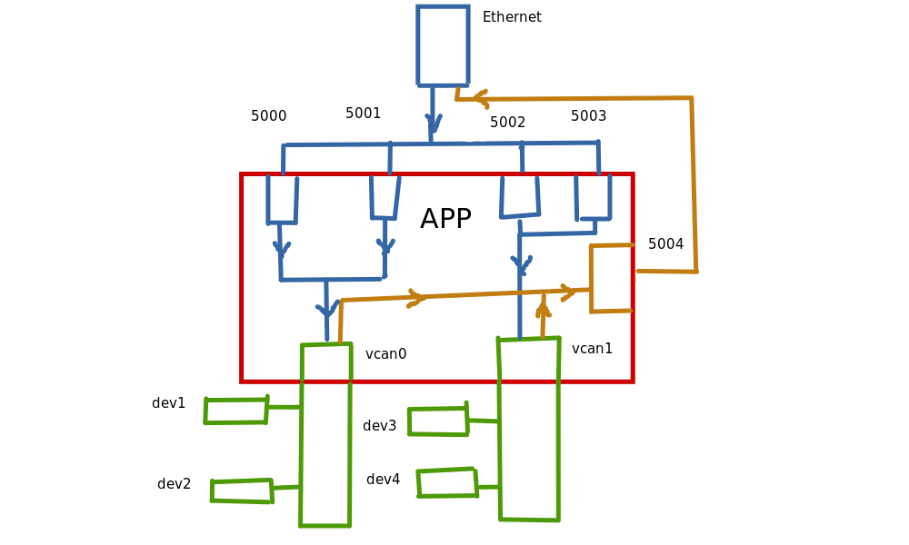

# Тестирование проекта

Для тестирования проекта реализуем подключение по следующей схеме.


Здесь входящие порты 5000, 5001, 5002, 5003 связываются с устройствами dev1, dev2, dev3,dev4 соответственно на интерфейсах vcan0 и vcan1.

## Проверка соединения UDP-CAN
Для проверки соединения необходимо отправлять в UDP порты 5000, 5001, 5002, 5003 localhost'a пакеты. Для этого воспользуемся командой:
```
echo > /dev/udp/localhost/5000
echo > /dev/udp/localhost/5001
echo > /dev/udp/localhost/5002
echo > /dev/udp/localhost/5003
```
Для просмотра данных пришедших на CAN шину vcan0 и vcan1 воспользуемся командами:
```
cansniffer vcan0
cansniffer vcan1
```

## Проверка соединения CAN-UDP
Для проверки соединения необходимо прослушать UDP сокет localhost:5004. Для этого воспользуемся утилитой netcat:
```
nc -l -u 5004
```
Далее необходимо имитировать данные отправляемые устройством на CAN шине. В сообщении закодируем имя CAN интерфейса, через который отправляются данные. В таблице ascii строке "vcan0" соответствует 564341E30 hex значение. Для строки "vcan1" hex значение равно 564341E31. Для имитации данных, отправляемых устройством на CAN шине воспользуемся утилитой cangen:

```
cangen vcan0 -g 2000 -I 42A 564341E30 -L 8
cangen vcan1 -g 2000 -I 42B 564341E31 -L 8
```
### NOTE:
По какой-то причине утилита netcat не выводит все данные, пришедшие в порт. Простой UDP сервер, написанный на языке C, который читает пришедшие в порт данные, оказывается более предсказуемым и показывает результаты отличные от утилиты netcat. Возможно, netcat действительно не лучшая тулза для чтения пакетов. В итоге самописный UDP сервер выдает ожидаемые данные, которые соответствуют требованиям.  
